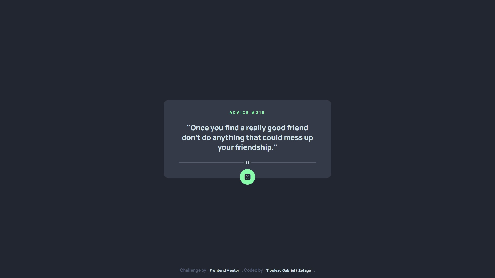

# Frontend Mentor - Advice generator app solution

This is a solution to the [Advice generator app challenge on Frontend Mentor](https://www.frontendmentor.io/challenges/advice-generator-app-QdUG-13db). Frontend Mentor challenges help you improve your coding skills by building realistic projects.


### The challenge

Users should be able to:

Random advice when click button !

### Screenshot



### Links

- Solution URL: [My Advice generator Solution](https://www.gt-dev.net/challenge/advice-generator/)

### Built with

- Semantic HTML5 markup
- CSS custom properties
- Flexbox
- Mobile-first workflow
- [jQuery](https://jquery.com/) - jQuery Library


### What I learned

```html
<h1>Some HTML code I'm proud of</h1>
```
```css
.proud-of-this-css {
  color: papayawhip;
}
```
```js
const proudOfThisFunc = () => {
  console.log('🎉')
}
```

### Continued development

### Useful resources

- [jQuery](https://www.jquery.com) - jQuery is a fast, small, and feature-rich JavaScript library. It makes things like HTML document traversal and manipulation, event handling, animation...
- [Font Awesome](https://fontawesome.com/) - Font Awesome is the Internet's icon library and toolkit, used by millions of designers, developers, and content creators.
- [cdnjs](https://cdnjs.com/) - cdnjs is a free and open-source CDN service trusted by over 12.5% of all websites, serving over 200 billion requests each month, powered by Cloudflare.
- [Google Fonts](https://fonts.google.com/) - Making the web more beautiful, fast, and open through great typography.

## Author

- Website - [Tibuleac Gabriel](https://www.gt-dev.net/)
- Frontend Mentor - [@Zetago](https://www.frontendmentor.io/profile/Zetago)


